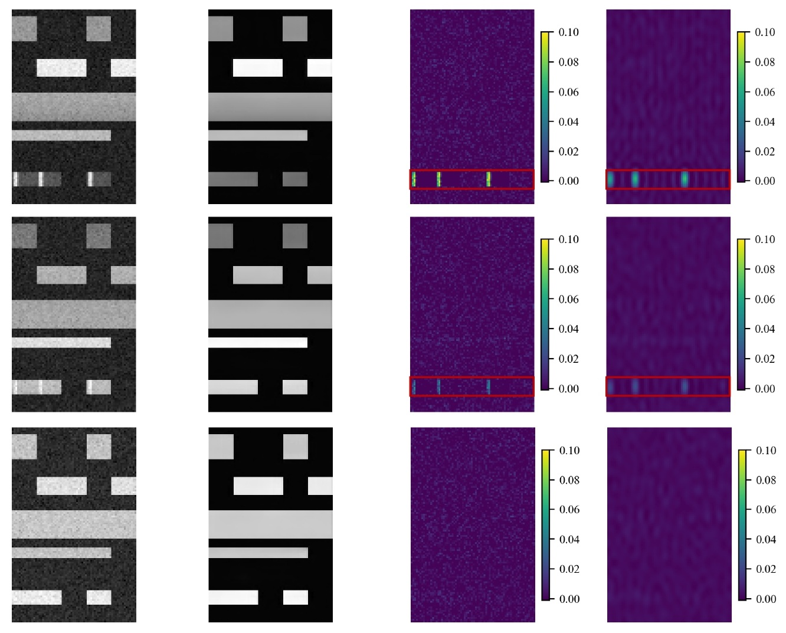

# Anomaly Detection

Here we implement and evaluate two approches for anomaly detection in OFDMA systems using our dataset.

<p align="center">
  
</p>

---

# Dataset

Download the dataset from the following link:

 [](https://doi.org/10.5281/zenodo.20341906)

After downloading the dataset, unzip and place it inside the `Example_Use/Dataset` directory.

---

# Installation

Clone the repository:

```bash
git clone https://github.com/akdd11/ofdma-spectrum-anomalies-simulation.git
cd ofdma-spectrum-anomalies-simulation/Example_Use
```

Install required dependencies:

```bash
pip install -r requirements.txt
```

---

# Training

To train the unsupervised (VAE) model, run:

```bash
python src/train_unsupervised.py --data_path ".\Dataset" --Max_LR 1e-4
```

To train the supervised (ResNet) model, run:

```bash
python src/train_unsupervised.py --data_path ".\Dataset" --Max_LR 1e-2
```

Or, to fine-tune the ResNet18 model using the pretrained weights located at `initial_path`, run:

```bash
python src/train_unsupervised.py --data_path ".\Dataset" --Max_LR 1e-2 --initial_weights "initial_path"
```


The trained weights are provided in the `Example_Use/Weights` directory. 
You can use the jupyter notebooks provided to evaluate each method and visualise the detected anomalies for each sample.


---

# Model Preference

We recommend the VAE model based on two key advantages:
* Its ability to generalize detection performance to previously unseen jammer types
* It's possible to localize jammers within a spectrum image for specific jammer types

