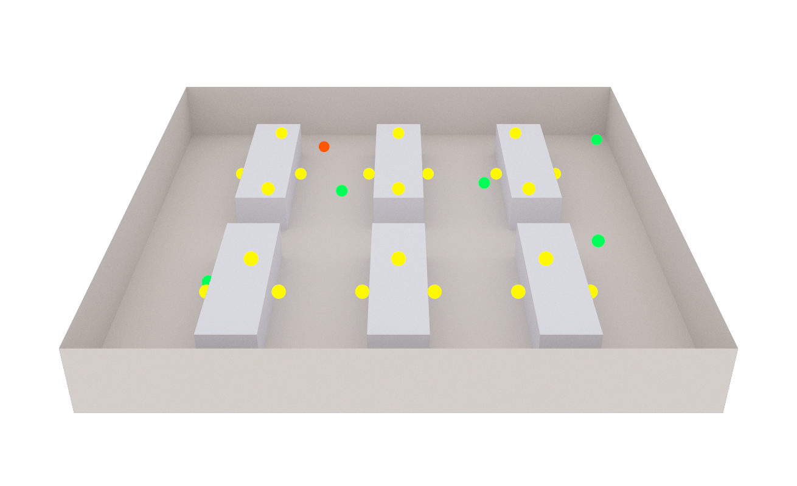
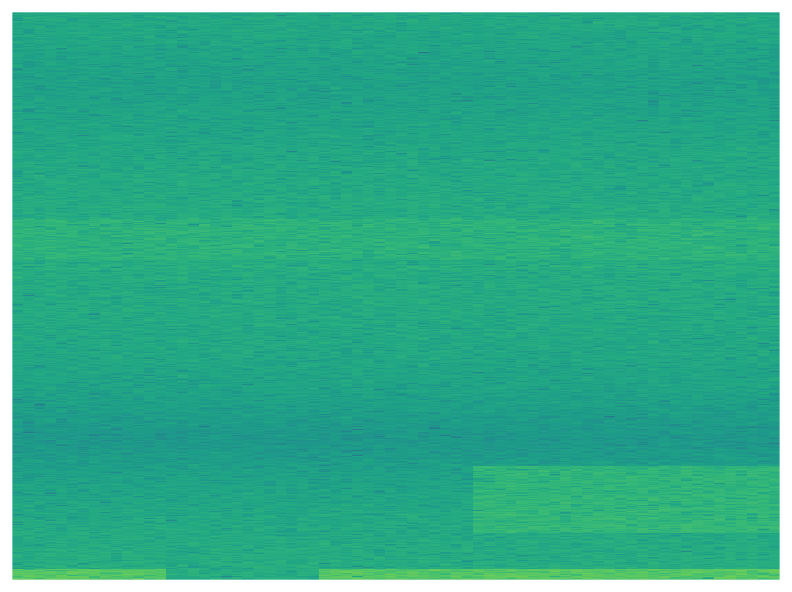
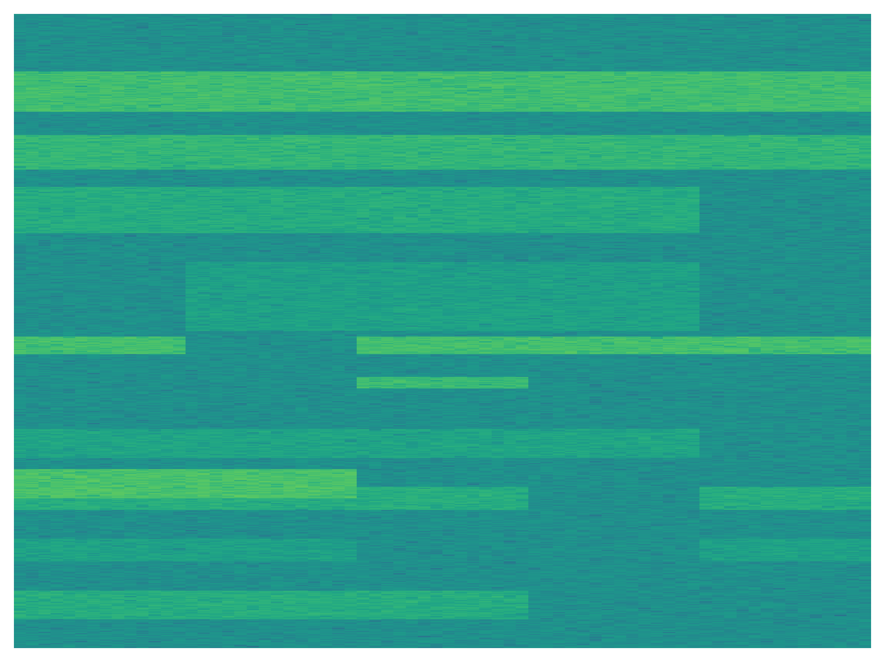
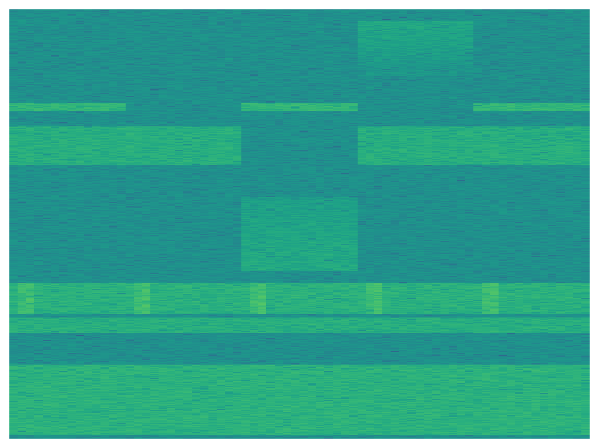
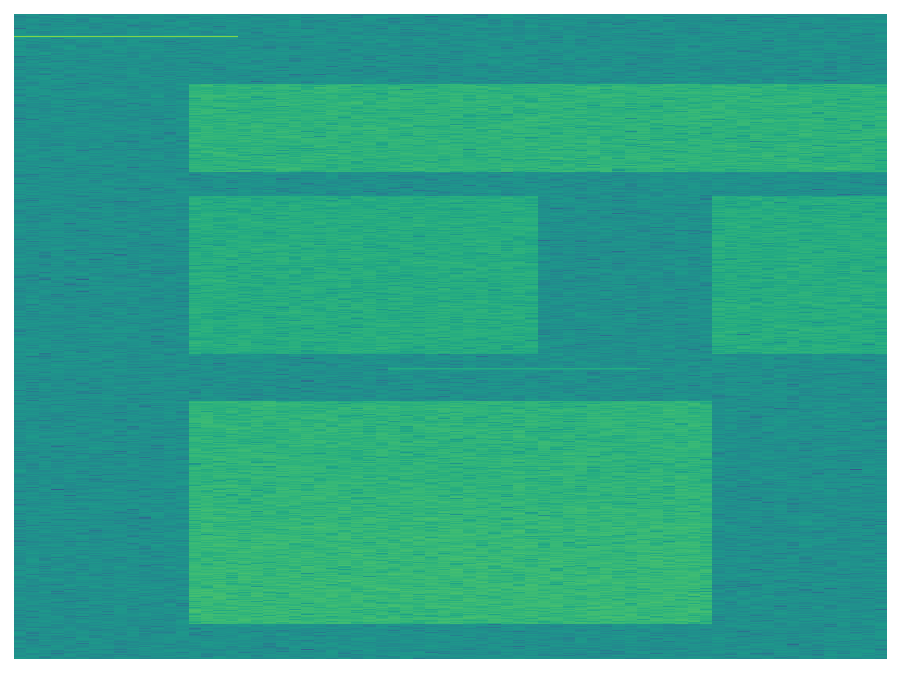
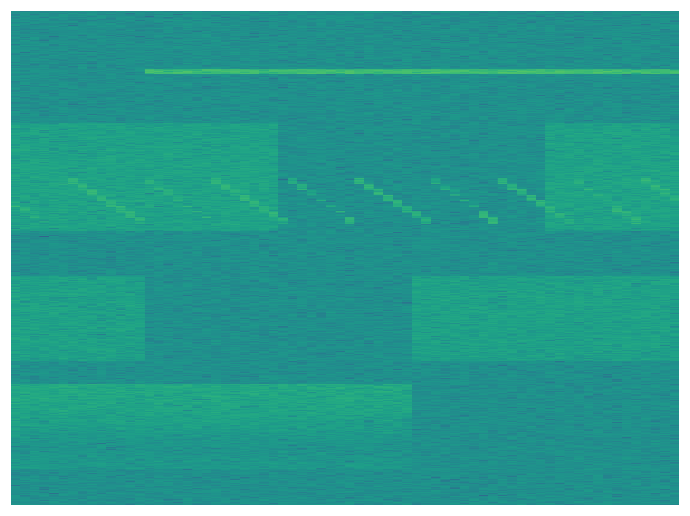
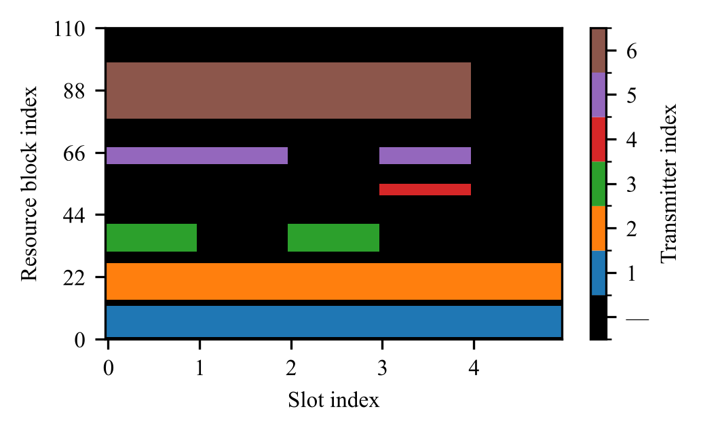

# OFDMA Spectrum Anomaly Simulation

## Abstract

This repository belongs to the paper "Spectrum Anomaly Detection in OFDMA Systems: Simulation Framework and Benchmark Dataset", available on arXiv: [arXiv:2606.02102](https://arxiv.org/abs/2606.02102). It provides a modular, open-source simulation framework for generating physics-driven datasets of spectrum anomalies in OFDMA systems. It combines Blender and the Mitsuba add-on for ray-traced channel generation with Sionna-based processing to produce labeled spectrograms suitable for training and benchmarking machine learning models for spectrum anomaly detection. The framework supports configurable scenarios (legitimate transmitters, jammers, varied propagation conditions), produces detailed labels for each sample, and includes scripts to reproduce dataset generation and evaluation. The code and datasets accompany the paper "Spectrum Anomaly Detection in OFDMA Systems: Simulation Framework and Benchmark Dataset", available on arXiv, and are intended to enable reproducible research and quantitative comparison of anomaly detection methods.

The dataset is available for download at Zenodo:

 [](https://doi.org/10.5281/zenodo.20341906)

The three steps towards generating a dataset, namely scene generation, data generation, and creating image data and labels, are described in the following sections.

## Scene Generation

The key of this simulation is a scene, in which ray tracing is executed to obtain channel frequency responses (CFRs) between transmitters and sensing units. The corresponding scene is created with a Python script in Blender, which creates the scene and exports it in a format that can be loaded by Sionna. The scene used to generate the dataset, together with the sensing units and a random set of legitimate transmitters and a jammer, is shown in the figure below.

<p align="center">
    
</p>

### Requirements

* Blender 4.2.19 LTS
* Mitsuba Add-on for Blender 0.4.0 (follow the installation instructions [here](https://github.com/mitsuba-renderer/mitsuba-blender))

### Usage

Open Blender and go to the Scripting workspace. Open the `blender-python/create_scenario_with_obstacles.py`. It creates a scene according to the specifications in `blender-python\conf\scene_attributes.yaml`. The scene is exported to the `scenes` directory in the repository root. The exported scene can then be loaded by Sionna to perform ray tracing.

## Data Generation

### Requirements

The simulation workflow has been developed with Ubuntu 24.04, Python 3.10.4, and Sionna 1.2.2. The requirements for the Python virtual environment are listed in the file `requirements_simulation.txt`.

### Create custom intermediate data

Entry path for the simulation is the script `src/dataset_generation.py`, which executes the ray tracing and creates custom intermediate data. Simulation parameters can be configured in the file `src\conf\dataset_generation.yaml`. The dataset number and number of samples can also be configured via the command line, run with `-h` for details.The coordinates of the sensing units are specified in the file `src\conf\su_coordinates.yaml`.

The generated data is stored in the directory that is specified in the file `datapath.txt` which is located in the repository root. In this directory, a subdirectory with the specified dataset number is created, in which the custom intermediate data is stored in a subdirectory named `custom`.

### Create image data and labels

To further utilize the data, the script `src/create_image_data_and_labels.py` can be executed, which creates spectrogram images and labels from the custom intermediate data. The dataset number can be configured via the command line, run `python src/create_image_data_and_labels.py -d <dataset_number>` to specify it. The generated spectrograms are stored in the same directory as the custom intermediate data in the subdirectory `images`. Two types of images are generated:
* Spectrograms per sensing unit (SU): The images are normalized spectrograms and the filename format is `spectrogram-{sample_idx}-{su_idx}.png`. The spectrograms are normalized over the entire dataset, so the same minimum and maximum values are used for all spectrograms. This allows for a consistent representation of the spectrograms across different samples and sensing units. The minimum and maximum values are contained in the file `spectrogram_min_max.csv`, which is stored in the root of the dataset folder.
* Resource allocation images: Those images contain the resource allocation of the transmitters. They are 8-bit PNG images, in which 0 corresponds to not allocated and any other value corresponds to the allocated transmitter index. The filename format is `alloc_res-{sample_idx}.png`. 

In addition, in the same directory, a file named `labels.csv` is created, which contains the following labels for each sample:
* `jammer_type`: Type of the jammer (if there is no jammer, the value is "no jammer")
* `jammer_power`: Transmit power of the jammer in dBm (if there is no jammer, the value is NaN)
* `jammer_location`: Location of the jammer (if there is no jammer, the value is NaN)
* `num_legitimate_transmitters`: Number of legitimate transmitters in the scene
* `snr_by_su_<su_idx>`: Signal-to-noise ratio (SNR) at each sensing unit (SU) in dB
* `sjr_by_su_<su_idx>`: Signal-to-jammer ratio (SJR) at each sensing unit (SU) in dB


### Load the data

As a starting point, the notebook `notebooks/plot_spectrograms.ipynb` shows how to load the generated spectrograms (and labels) and plot them.


#### Spectrograms

Below are example images of the generated spectrograms. Note, that the provided images are in grayscale, but are shown for better visibility here with a colorscale.

<table align="center" style="border: none;">
  <tr>
    <td align="center">
      <br>
      <b>Barrage Jammer</b>
    </td>
    <td align="center">
      <br>
      <b>Deceptive Jammer</b>
    </td>
  </tr>
  <tr>
    <td align="center">
      <br>
      <b>Pilot Jammer</b>
    </td>
    <td align="center">
      <br>
      <b>Random Hop Jammer</b>
    </td>
  </tr>
  <tr>
    <td colspan="2" align="center">
      <br>
      <b>Sweep Jammer</b>
    </td>
  </tr>
</table>

#### Resource Allocation

The notebook `notebooks/plot_resource_allocation.png` shows how to load the resource allocation images. 

**NOTE**: The resource allocation images are 8-bit PNG images, with the pixel value corresponding to the transmitter index (0: not allocated). Hence, the images seem almost completely black, but the information is still correctly contained in the images. For visualization below and in the paper, a discrete color scheme has been applied to highlight the allocations to the users.

<p align="center">
  
</p>


### Documentation

Generate the documentation for the simulation framework from the root of the repository with the following command:

```bash
pydoctor --config pydoctor.ini
```

## Detection

The baseline models for supervised and unsupervised detection are separated from the simulation framework. The corresponding code and supplements can be found in the `Example_Use` folder, which also has a separate README file. The code for the baseline models is provided as a starting point and can be further developed and improved. The code for the baseline models is not required to generate the dataset, but it can be used to evaluate the generated dataset and to provide a benchmark for future research on spectrum anomaly detection in OFDMA systems.

# Citation

If your are using the code or dataset in this repository, please cite the following paper:

```bibtex
@misc{schösser2026spectrumanomalydetectionofdma,
      title={Spectrum Anomaly Detection in OFDMA Systems: Simulation Framework and Benchmark Dataset}, 
      author={Anton Schösser and Mohammadhadi Salehi and Sinuo Ma and Philipp Schulz and Gerhard Fettweis},
      year={2026},
      eprint={2606.02102},
      archivePrefix={arXiv},
      primaryClass={eess.SP},
      url={https://arxiv.org/abs/2606.02102}, 
}
```